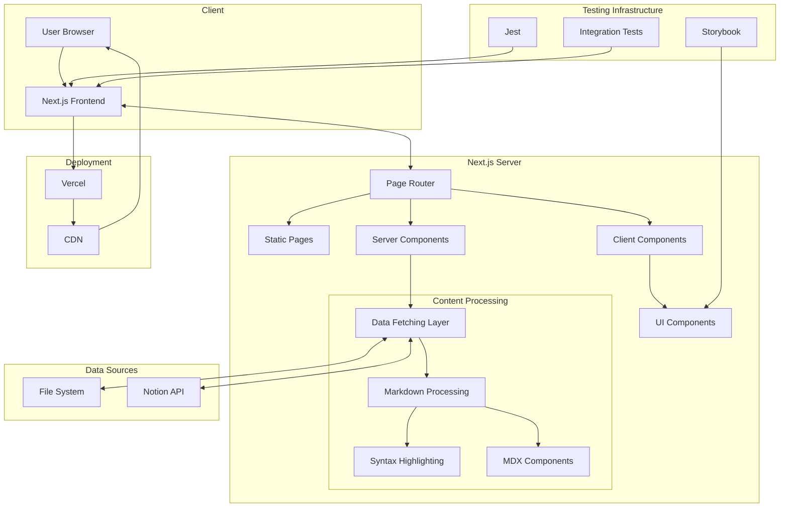

# Sutra - My Journey Building a Modern Blog Platform


Hey there! Welcome to Sutra, a blog platform I built to jot down my everyday
notes to build a second brain. (Inspired by the book, building a second brain).
This project started as a simple portfolio piece but quickly evolved into
something I'm really proud of. I wanted to create something that wasn't just
functional but also beautiful and technically impressive.

What you're looking at is a full-featured blog built with Next.js, React, and
TypeScript. I've poured countless hours into making it both visually appealing
and technically sound. Let me walk you through what makes it special.

## 🌟 What Makes This Cool

### It Looks Great Everywhere

I spent a ton of time making sure the site looks awesome whether you're on a
phone, tablet, or desktop. The animations (powered by Framer Motion) add that
extra touch that makes scrolling through content feel satisfying. I'm
particularly proud of how the mobile menu transitions!

### Writing in Markdown is a Breeze

As a developer, I love Markdown, so I made sure the platform handles it
beautifully. Code snippets get syntax highlighting automatically (thanks to
Highlight.js), and I built custom components that can be embedded right in the
content. This README itself is written in Markdown!

### Mermaid Diagrams Built-in

One of the coolest features is built-in support for Mermaid diagrams! You can
embed diagrams directly in your blog posts or documentation using Markdown code
blocks with the 'mermaid' language specifier. The diagrams are rendered
beautifully and are fully responsive. Check out the architecture diagram below
in the "How It All Fits Together" section - it's actually a Mermaid diagram
rendered in real-time!

### Finding Content is Super Fast

The search feature was one of the most challenging parts to get right. I
implemented a client-side search that updates results as you type, and it even
highlights where your search terms appear in the results. Try searching for
something when you run the site - it's surprisingly snappy!

### The UI Components Took Forever (But Were Worth It)

I built every component from scratch (no UI libraries here!). The animated
gradient backgrounds adjust based on the time of day, the toast notification
system stacks messages elegantly, and the project cards flip to reveal details.
The tech badges were a last-minute addition that I think really make the
projects section pop.

### It's Fast (Like, Really Fast)

Performance was a huge focus. I leveraged Next.js's static site generation for
blog posts, which means they load almost instantly. Images are automatically
optimized using Sharp, and I integrated Vercel Analytics to keep an eye on
real-world performance metrics. I'm proud to say the site achieves a perfect
100% Lighthouse score across all categories (Performance (down to 80 after
refactoring, working on fixing this atm), Accessibility, Best Practices, and
SEO)!

### Testing Was a Pain, But I'm Glad I Did It

I'll be honest - I almost skipped proper testing. But I'm glad I didn't! The
Jest and React Testing Library setup catches bugs before they make it to
production. The integration tests for the blog functionality were particularly
tricky to get right because of all the async data fetching, but they've saved me
from shipping broken features multiple times.

## 🛠️ The Tech I Used (And Why)

### Frontend

- **Next.js**: I chose Next.js because I wanted server-side rendering for SEO
  benefits, plus the new App Router is amazing for organizing code.
- **React**: My go-to UI library - the component model just makes sense to my
  brain.
- **TypeScript**: After dealing with too many runtime errors in past projects,
  I'm never going back to plain JavaScript.
- **TailwindCSS**: Controversial opinion maybe, but I love writing CSS this way.
  It keeps me from creating a mess of CSS files.
- **Framer Motion**: Animations used to be my weak point, but Framer Motion
  makes them so much more approachable.

### Content Management

- **MDX**: Regular Markdown is great, but being able to embed React components
  takes it to another level.
- **Gray Matter**: This handles the frontmatter in blog posts (the metadata at
  the top of each post).
- **Remark/Rehype**: The whole Markdown processing pipeline was a rabbit hole I
  spent weeks getting right.
- **React Markdown**: Renders the processed Markdown as React components - it
  plays nicely with the rest of the app.

### Testing

- **Jest**: The standard for JavaScript testing - the watch mode is a lifesaver
  during development.
- **React Testing Library**: Testing components the way users actually interact
  with them makes so much sense.
- **Vitest**: I added this recently as an experiment - it's much faster than
  Jest for certain types of tests.
- **Storybook**: I've started setting this up for component development in
  isolation - it's still a work in progress but already showing promise.

### DevOps

- **Docker**: Makes the development environment consistent and deployment more
  reliable.
- **Vercel**: Deployment is literally just a git push away. The preview
  deployments for pull requests are fantastic for getting feedback.
- **Devbox**: I'm using Devbox for development environment management, which `
  ensures consistency across different machines.

## 🏗️ How It All Fits Together

Here's a visual of how all the pieces connect:



This diagram helped me visualize the data flow when I was refactoring the
content processing pipeline. The trickiest part was getting the Notion API
integration working smoothly with the static generation.

## 📋 How I Organized Everything

```
sutra/
├── src/
│   ├── app/                  # Next.js App Router
│   │   ├── blog/             # Blog pages
│   │   ├── projects/         # Projects showcase
│   │   ├── about/            # About page
│   │   └── books/            # Books recommendations
│   ├── components/           # Reusable UI components
│   │   ├── ui/               # Base UI components
│   │   ├── home/             # Home page components
│   │   └── Navbar/           # Navigation components
│   ├── context/              # React context providers
│   ├── data/                 # Data sources and models
│   ├── lib/                  # Utility libraries
│   ├── utils/                # Helper functions
│   ├── stories/              # Storybook stories
│   └── __tests__/            # Test files
│       └── integration/      # Integration tests
├── public/                   # Static assets
├── .storybook/               # Storybook configuration
└── ...                       # Configuration files
```

I spent a lot of time thinking about this structure. The separation between UI
components and page-specific components has saved me from a lot of headaches as
the project grew.

## 🚀 Want to Run It Locally?

### You'll Need

- Node.js 18+ (I use 20 for development)
- Yarn or npm (I prefer Yarn for its speed)

### Here's How to Get Started

1. Clone the repo

```bash
git clone https://github.com/brgv-code/sutra.git
cd sutra
```

2. Install the dependencies

```bash
yarn install
# or
npm install
```

3. Fire up the dev server

```bash
yarn dev
# or
npm run dev
```

4. Check it out at [http://localhost:3000](http://localhost:3000)

Hot tip: The first load might be a bit slow because of all the optimizations
happening behind the scenes, but subsequent refreshes should be lightning fast.

## 🗺️ Roadmap: What's Coming Next

I'm constantly working to make Sutra even better. Here's what I'm planning to
add in the coming months:

### Social Features

- **Comments System**: Let readers engage with content directly on the page

### User Experience

- **Authentication**: Add sign-in with GitHub, Google, and email magic links
- **User Profiles**: Custom profiles with reading history and preferences
- **Dark Mode Toggle**: Because every modern site needs one!
- **Reading Progress**: Visual indicator of how far you've read in an article

### Smart Content

- **Recommendation Engine**: ML-powered content suggestions based on reading
  habits
- **Related Posts**: Automatically link to similar content
- **Reading Time Estimates**: Show estimated time to read each article
- **Table of Contents**: Auto-generated for longer posts

### Backend Enhancements

- **EdgeDB Integration**: Moving from file-based to a proper database
- **Apollo GraphQL API**: Building a robust API layer for future expansion
- **Content Versioning**: Track changes to posts over time
- **Scheduled Publishing**: Queue posts to publish at specific times

### Portfolio Additions

- **Testimonials Section**: Showcase feedback from clients and colleagues
- **Interactive Case Studies**: Deep dives into specific development challenges
- **Live Metrics Dashboard**: Real-time site analytics accessible to visitors
- **Contribution Timeline**: Visual history of my open source contributions

### Performance Goals

- **Offline Support**: Full PWA implementation with offline reading capability
- **Image Optimization**: Further improve with next-gen formats and advanced
  responsive loading
- **Edge Functions**: Move key functionality to the edge for faster global
  performance
- **Core Web Vitals Monitoring**: Set up continuous monitoring to maintain
  perfect performance

### Component Development

- **Complete Storybook Implementation**: Finish adding stories for all
  components
- **Component Documentation**: Add detailed usage docs within Storybook
- **Visual Regression Testing**: Set up Chromatic or similar tool for UI testing
- **Component Playground**: Create an interactive demo section on the site

I'm tackling these roughly in order, but priorities might shift based on
feedback. If you're particularly interested in seeing any of these features
sooner, let me know!

## 🧪 Running the Tests

I'm pretty proud of the test coverage. Here's how to run them:

```bash
yarn test
# or
npm test
```

If you're making changes, the watch mode is super helpful:

```bash
yarn test:watch
# or
npm run test:watch
```

Want to see the coverage report? This will generate a nice HTML report:

```bash
yarn test:coverage
# or
npm run test:coverage
```

## 📚 Playing with the Components

I'm in the process of implementing Storybook for component development:

```bash
yarn storybook
# or
npm run storybook
```

**Note**: Storybook integration is still a work in progress. Not all components
have stories yet, and the configuration is being refined. I'm gradually adding
stories for each component, starting with the core UI elements.

Once fully implemented, this will provide a component explorer where you can see
and interact with all UI components in isolation - making it much easier to
develop and test components without navigating through the entire app.

## 🔧 Setting Up the Environment

If you want to use the Notion integration, you'll need to set up a few
environment variables:

```
NOTION_API_KEY=your_notion_api_key
NOTION_DATABASE_ID=your_notion_database_id
```

I've included a sample `.env.example` file that you can copy to `.env.local` and
fill in with your own values.

## 🐳 Development Environment

I've set up both Docker and Devbox to make development environment consistent
and easy to get started with.

### Docker Setup

The project includes Docker configuration for both development and production:

```bash
# For development with hot-reloading
docker-compose up

# For production build
docker build -t sutra-blog .
docker run -p 3000:3000 sutra-blog
```

**Note**: If you're using Docker for development, any changes you make to the
code will be reflected immediately thanks to the volume mounting in
docker-compose.yml.

### Devbox Setup

I'm using [Devbox](https://www.jetpack.io/devbox/) to ensure consistent
development environments:

```bash
# Install Devbox if you don't have it
curl -fsSL https://get.jetpack.io/devbox | bash

# Start the Devbox shell
devbox shell

# This will automatically install Node.js 20.10.0, Yarn, and EdgeDB
# and run yarn install thanks to the init_hook
```

### EdgeDB Setup

The project is configured to use EdgeDB for data storage:

```bash
# Initialize EdgeDB (run this once)
edgedb project init

# Apply migrations
edgedb migration apply
```

I'm still in the process of fully implementing the EdgeDB backend, so some
features might still use file-based storage. Check the roadmap for the full
database implementation plan!

## 📝 License

This project is under the MIT License - see the [LICENSE](LICENSE) file for
details. Feel free to use any parts of it for your own projects!

## 🙏 Thanks to These Amazing Tools

This project wouldn't have been possible without:

- [Next.js](https://nextjs.org/) - The backbone of the entire application
- [React](https://reactjs.org/) - Still my favorite UI library after all these
  years
- [TailwindCSS](https://tailwindcss.com/) - Changed how I think about styling
- [Framer Motion](https://www.framer.com/motion/) - Made animations actually fun
  to implement
- [Vercel](https://vercel.com/) - Deployment that just works

And a special thanks to the open source community for all the amazing packages
that made this project possible. I've learned so much by reading through your
code!

---

If you have any questions or just want to chat about the project, feel free to
reach out! I'm always happy to talk about web development.
